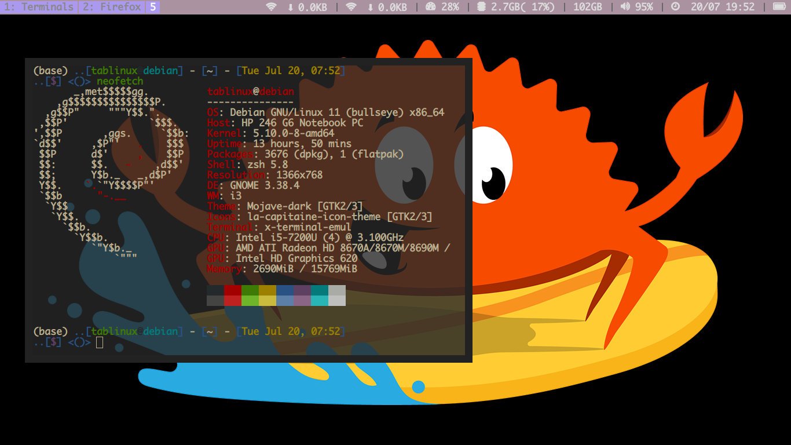
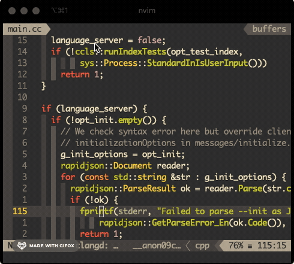

## Installation

```bash
bash <(curl -sLf https://git.io/JTvvG)
```

## Basic navigation
- [ line & char] __h__,__j__,__k__,__l__ for __left__, __down__ ,__up__, __right__
- [ word ] __w__,__b__,__e__, for __Word__,__Back__,__Next_Word_Tail__
- [ line jump ] f for quickscope to select which word to jump
- [ window scale jump ] S for hopWord (provided by hop.nvim)
- [ buffer content search ] <leader>fl for buffer line search (by Leaderfbuffer )


## navigate based on lsp [coc.nvim](https://github.com/neoclide/coc.nvim)

- __`<leader>ld`__ for go to definition
- __`<leader>lr`__ for go to reference
- __`<leader>lD`__ for go to Declaration
- __`<leader>li`__ for go to implementation
- __`<leader>x`__ for c plus plus language server extension by clangd and ccls
- interactive key select via which-key.vim

##  files, windows and buffer search
- __`<ctrl-g>`__ for project-wide Symbol Search by __[rg](https://github.com/BurntSushi/ripgrep)__
- __`<ctrl-p>`__ for project-wide file Search by __[leaderf](https://github.com/Yggdroot/LeaderF)__
- __`<leader>rr`__ for ranger-based search by __[ranger](https://github.com/ranger/ranger)__

## Git staff
- __`<leader>gD`__ for git-based diff
- __`<leader>gm`__ for git-based message
- __`<leader>gg`__ for git-based grep
- __`<leader>gh`__ for git-diff-based highlight
- __`<leader>gl`__ for git log


## Task by [AsyncTask](https://github.com/skywind3000/asynctasks.vim)
- __`<leader>kl`__ for **`list all defined task`**
- __`<leader>ke<Cr>`__ for **`edit local task`**
- __`<leader>kg<Cr>`__ for **`edit global task`**

## Others useful staff
- __`<leader>lv`__ for language translation provided by vim-translator


