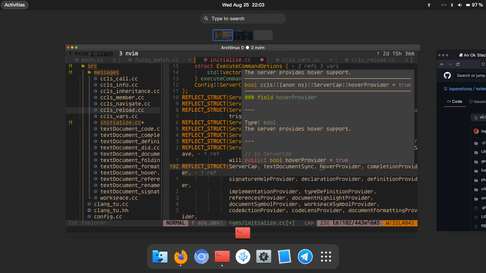
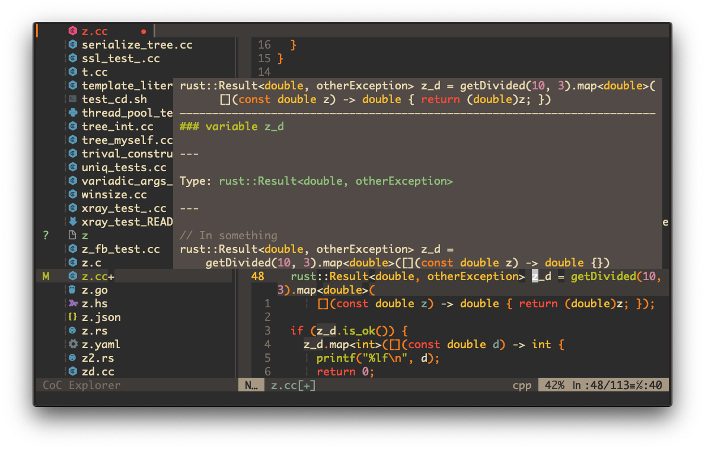

<div align="center">
    <h1 style="font-size:40px;color:red;background-color: #a1f1a2"> Neo <a href="https://github.com/yangyangwithgnu/use_vim_as_ide"; class="original-topic"; > Use_vim_as_ide </a> </h1>
</div>




#### [yangyangwithgnu](https://github.com/yangyangwithgnu) 说过所思即所获，本人也是基于这篇文章后跟随社区成长过来的，本文相对于那篇老文章对nvim做了几点改进，主要是：

## Table of content
* [对重插件youcompeteme转为基于lsp的clangd和ccls](#ccls和calngd融合)
* [支持多种语言的补全，语义跳转: rust go java typescript vue.js react](#多种语言支持)
* [改变基于正则匹配的语法高亮，转而使用tree-sitter基于编译器的语法高亮](#语法高亮)
* [neovim的ui系统做了现代化，用barbar.nvim 来展示title bar,coc explore 并加入vim devicons](#ui系统现代化)
* [模糊搜索，全文跳转，当前文件内容搜索等等](#模糊搜索)
* [小工具集成,whick-key,easymotion,cppman,translate,markdown render](#小工具)
* [一键安装代码,包括debian发行版的工具链拉取,请安装好node,golang(optional)](#Installation)
* [光标移动的键位绑定,这是不使用鼠标的提供者](#essential_keybinding_table)

<!-- more --> 

## ccls和calngd融合
- 小孩子才做选择，大人选择全都要。
    - clangd和ccls在使用过程中都有自己的优点，比如clangd生成的hover展示的效果要比ccls好，函数参数，文档解释分开展示，完美透过hover就可以有很好的理解。而ccls有自己的基于json-rpc的扩展方法，在面向对象中，可以展示纯虚函数的实现，从实现跳转到接口(c++的接口就是纯虚函数)，本配置对ccls和clangd的初始化选项做了调整，可以只展示clangd的hover而不展示ccls生成的，又保证ccls的扩展功能在nvim的key binding中。

## 多种语言支持
- 在lsp一统江湖的时代，在vim实现多语言补全支持不再成为难题
    - 如今已经进入云原生和微服务的时代，语言不应该成为后端工作者的标签，说白了编译式语言中大部分都是基于 load-store执行模型，互联网资源的交换都是基于大部分都是基于http协议，开发基础都是来自于restful api风格。所以没有必要再把自己绑定在一种语言上，我倾向于主c++，并努力探索rust语言的可能性。
        - 想用c++开发restful服务，可以把[pistache](https://github.com/pistacheio/pistache)拉下来自己做一做实验，其实也没有那么难
        - 当然你会说java支持反射，不过[graalvm](https://graalvm.org) 已经在做这方面的努力让java的反射在编译期间就能偶确定，ccls实现中reflect函数也值得你去研究，rust这种zero overhead的元编程的反射也可以了解一下。
    - 而前端中出现了vue和react基础，以前单页面的模式基本上到了维护期，特别是typescript语言的出现，学了之后你才会真的发现程序语言不仅仅是编译原理，里面的类型系统，构造，析构，闭包，等等都对程序开发的效率有提高。特别是你学c++语言之后，你发现里面的概念都是相通的，当然你学java之后也可以对应到。
        - 你要上手vue项目的化可以把[yesPlayMusic](https://github.com/qier222/YesPlayMusic)拉下来自己浏览代码，你会发现这才是未来

## 语法高亮
- tree-sitter 已经被nvim内置了
    - 曾今一代c++规范出来之后，vim的c++ syntax文件就要重新更新，或者改变新的插件来对高亮错误进行修改，但是tree-sitter换了一个思路，选择用编译器的词法分析得到的结果来决定对应的identifier的现实颜色，tree-sitter原本来自于github给atom编辑器的语法高亮，后来被移植到nvim中，其增量编译的特性保证开销是可以接受的，并且不会在出现恼人的bug影响视觉感受了。

## ui系统现代化
- 选择nvim就是因为他的ui系统比较新
    - 有些人可能选择nvim会列出其他的种种，比如不同担心其他语言的绑定在编译期间没有完成，lua脚本的执行效率比vim script高，但是我就是颜值动物，nvim内置了tui(terminal ui) 就是我选择它的理由，vim-airline插件和barbar.nvim可以把这种特性发挥到我认为很好的层面了。现代软件中相较于比较老的软件一打特性在ui设计上就是注重扁平化，devicons是vim中提供的基于utf-8编码的小图标，对文件，源代码文件基于文件类型展示对应icon，对于编程人员是一种好的效果展示。
    - 除了neovim所做出的努力，nerdfont 在另一个角度来说，对比modern系统和比较老的系统之间也有很大的差别，移值微信，qq，tencent meeting到wine中做的事情也是先把微软雅黑装好，在谈其他。所以系统装好之后第一件事情装nerdfont，更改.icons文件配置，更改.theme文件配置，形成可以接受的ui系统，终端字体设置成agave nerd font，系统字体设置成PingFang SC。形成对视觉的保护。

<div align="center">

</div>

## 模糊搜索
- unix的哲学是做一件小事并把它做到极致
    - fzf rg 都是命令行中优秀的搜索工具，vim插件对这两个工具都做了集成，保证在不脱离vim的情况下也可以调用这些工具来完成内容的搜索并跳转到指定位置
    - 同样nvim插件也发展出了自己的模糊搜索工具leaderf，同样的不做选择，被集成到配置中，你敲击 **sapce+f**  后可以看到具体的搜索选项，行搜索，全文搜索，最近使用文件，打开窗口都可以进行搜索。

## 小工具
- vim插件有很多可以提高效率的插件，这里一并阐述
    - whick-key.vim：没有人会去花时间记键位绑定(好吧 hjkl你应该烂熟于胸)，所以whick-key.vim 被开发出来帮助我们记忆我们配置文件中键位绑定，vim核心提高编程效率的方法是使用键位绑定来帮助完成重复性的工作，同时减少你去够鼠标花费的时间.
    - vundle -> vim-plug : 都是vim插件管理工具，但是后者可以同时支持16个线程的下载，以及类似于deb package的post script的功能，被广泛使用。
    - easymotion和hop.vim： fuzzy search很强大，hjkl功能又很小，hop.vim能够对当前展示的文档中对每个word都提供一个place holder，只要按下对应的holder键位 就可以跳转到那个位置，这在写基于英文字母的编程语言的时候跳转起来很方便(如果你在浏览器中使用过vimium就很好理解)
    - English completion : 有的时候我们记得英文单词的大概轮廓，但是忘记了具体应该是什么样子，所以没办法流畅的写英文文档，也没有一款基于lsp的英文补全工具，但是vim自带的字典补全功能可以满足我们的需求，同时社区也提供translate工具让你对文档中的单词进行翻译，也被本配置考虑并收取
    - markdown 实时预览 ：日常在markdown的编写过程中，我们需要实时的预览我们写成了什么样的文档，这对结果导向的我们是一个好的工具，根据filetype，配置给了一个编译执行键位，space+d+d markdown触发实时渲染，c++触发编译执行，go直接执行 ```go run %```
    - cppman : linux torvalds说 ```read the fuck source code``` 对于一个专业的人来说，这会是必经之路，但是对于一个初学者，在还没有对库有很好的理解的时候，应该选择```read the fuck manual```, cppman 就是这样一个工具让你能够从 cpluspluc.com中拉取到c++库函数对应的文档，你需要将这些东西先执行一下缓存，到时候就不会有漫长的等待拉取的时间。

## Installation

```bash
bash <(curl -sLf https://git.io/JTvvG)
```

## essential_keybinding_table
| technology | key binding | explanation | provided by |
|---|:-:|:-:|:-:|
|🐮 cursor movement | __`h,j,k,l`__ | __left__, __down__ ,__up__, __right__   | vim builtin |
|🐮 cursor movement  |__`w,b,e`__ | __Word__,__Back__,__Next_Word_Tail__    | vim builtin |
|🐮 cursor movement| __`f`__  |quickscope to select which word to jump | [easymotion](https://github.com/easymotion/vim-easymotion) |
|🐮 cursor movement| __`S`__  | window scale jump  | [hop.nvim](https://github.com/phaazon/hop.nvim) |
|🤓 window management| __`c-q`__  | close all windows | vim builtin |
|🤓 window management| __`Q`__  | close current window | vim builtin |
|🤓 window management| __`<leader>v`__  | vsplit window | vim builtin |
|🤓 window management| __`<leader>h`__  | split window | vim builtin |
|⚛ lsp protocol | __`<leader>fl`__  | buffer content search   | [leaderf](https://github.com/Yggdroot/LeaderF)  |
|⚛ lsp protocol| __`<leader>ld`__ | go to definition| [coc.nvim](https://github.com/neoclide/coc.nvim)|
|⚛ lsp protocol|  __`<leader>lr`__ | go to reference | [coc.nvim](https://github.com/neoclide/coc.nvim)|
|⚛ lsp protocol|  __`<leader>lD`__ | go to Declaration | [coc.nvim](https://github.com/neoclide/coc.nvim) |
|⚛ lsp protocol|  __`<leader>li`__ | go to implementation |  [coc.nvim](https://github.com/neoclide/coc.nvim) |
|⚛ lsp protocol|  __`<leader>x`__ |  clangd and ccls extension| [ccls](https://github.com/maskray/ccls) & [clangd](https://llvm.org) |
|🆚 fuzzy search| __`ctrl-g`__ | project-wide Symbol Search  | __[rg](https://github.com/BurntSushi/ripgrep)__ | 
|🆚 fuzzy search| __`ctrl-p`__ | project-wide file Search  | __[leaderf](https://github.com/Yggdroot/LeaderF)__  |
|🆚 fuzzy search| __`:FZF`__ | project-wide file Search  | __[fzf](https://github.com/junegunn/fzf.vim)__  |
|🐂 file manager | __`<leader>rr`__ | ranger-based search  | __[ranger](https://github.com/ranger/ranger)__  |
|🐂 file manager | __`<leader>e`__ | file tree | __[coc.nvim](https://github.com/neoclide/coc.nvim)__  |
