 ```bash
 _   _       _           
| \ | |_   _(_)_ __ ___  
|  \| \ \ / / | '_ ` _ \ 
| |\  |\ V /| | | | | | |
|_| \_| \_/ |_|_| |_| |_|

 ```

<link rel="stylesheet" type="text/css" herf="./res/style.css">


<font face="agave Nerd Font" size=5>
<b>
<i>

#### Installation
```bash
bash <(curl -sLf https://git.io/JTvvG)
```
#### Install manually by __[DetailInstalltion](./doc.md)__

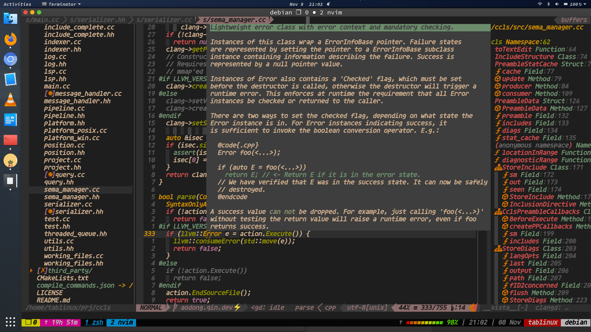
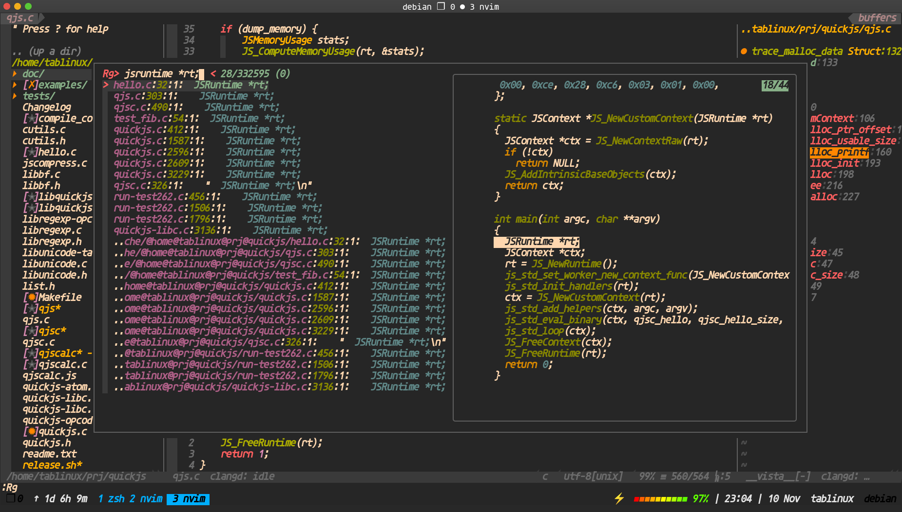


#### Basic navigation
- [line & char] __h__,__j__,__k__,__l__ for __left__, __down__ ,__up__, __right__
- [word ] __w__,__b__,__e__, for __Word__,__Back__,__Next_Word_Tail__

#### Source trace based on lsp [coc.nvim](https://github.com/neoclide/coc.nvim)

- __`<leader>ld`__ for go to definition
- __`<leader>lr`__ for go to reference
- __`<leader>lD`__ for go to Declaration
- __`<leader>li`__ for go to implemention

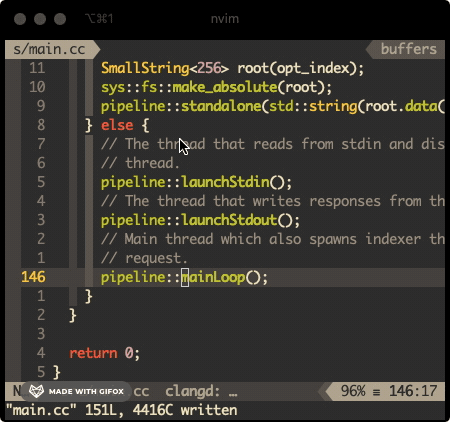
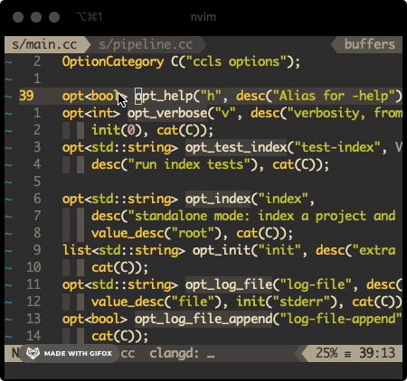


#### Search
- __`<ctrl-g>`__ for project-wide Symbol Search by __[ripgrep](https://github.com/BurntSushi/ripgrep)__
- __`<ctrl-p>`__ for project-wide file Search by __[fzf](https://github.com/junegunn/fzf)__
- __`<leader>rr`__ for ranger-based search by __[ranger](https://github.com/ranger/ranger)__

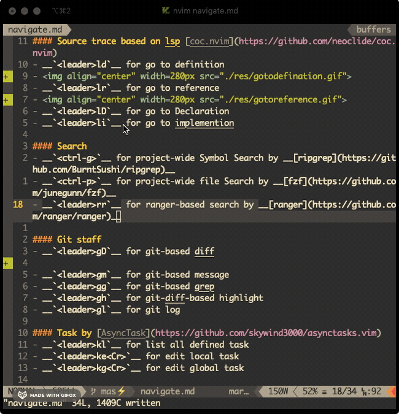
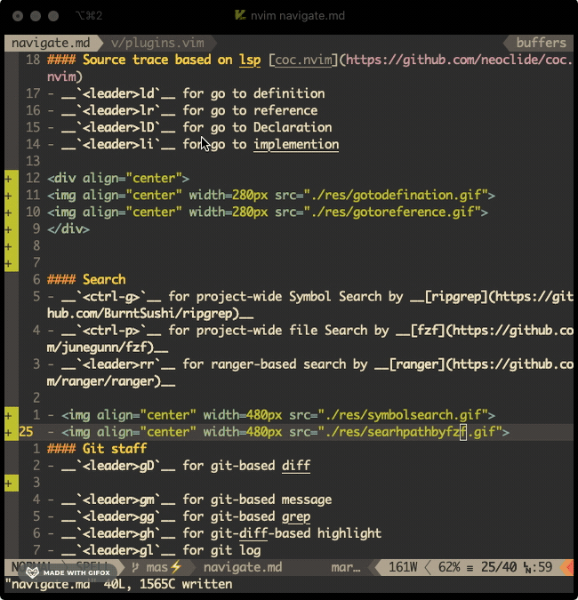
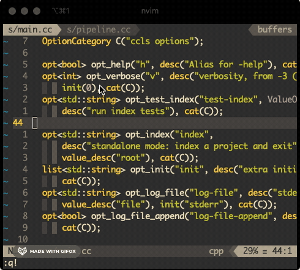

#### Git staff
- __`<leader>gD`__ for git-based diff
- __`<leader>gm`__ for git-based message
- __`<leader>gg`__ for git-based grep
- __`<leader>gh`__ for git-diff-based highlight
- __`<leader>gl`__ for git log

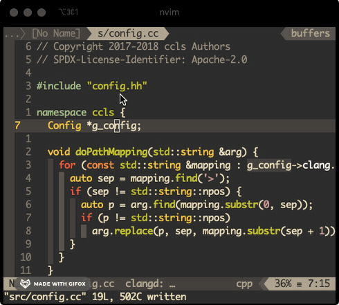
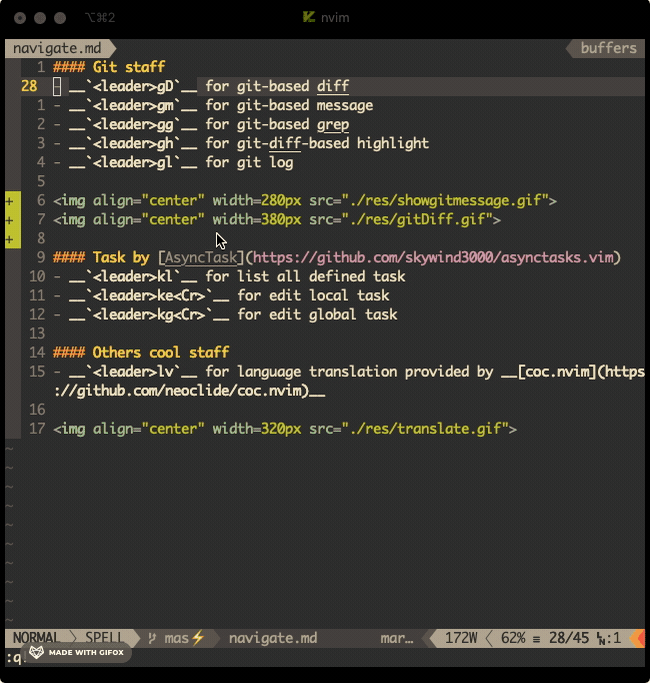

#### Task by [AsyncTask](https://github.com/skywind3000/asynctasks.vim)
- __`<leader>kl`__ for **`list all defined task`**
- __`<leader>ke<Cr>`__ for **`edit local task`**
- __`<leader>kg<Cr>`__ for **`edit global task`**

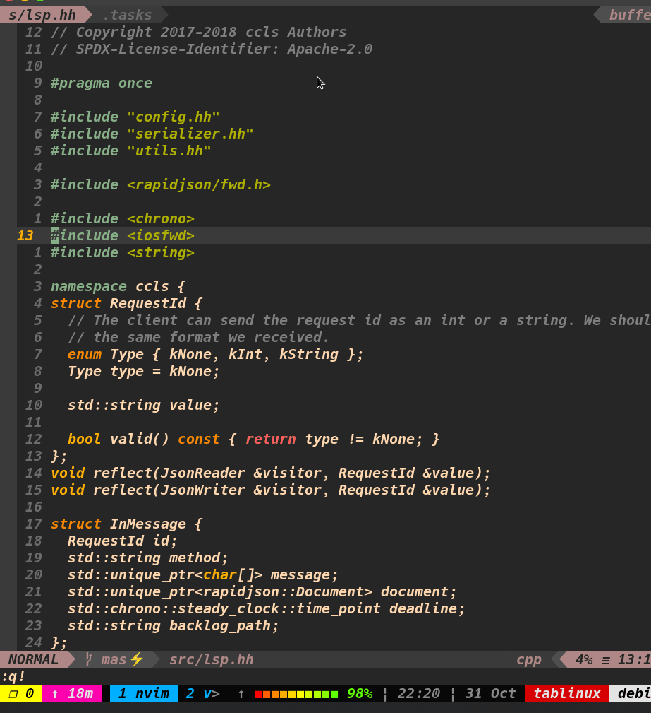

#### Others cool staff
- __`<leader>lv`__ for language translation provided by __[coc.nvim](https://github.com/neoclide/coc.nvim)__


#### Suggestion

</i></b>
</font>

<font face="agave Nerd Font" size=5>
<p> 
<b><i>
不同的字体对于编程的体验有非常大的区别,好的字体能够对自己写代码有促进作用，根据自己对 [Nerd　Font](https://github.com/ryanoasis/nerd-fonts) 的尝试，我采用的是agave Nerd Font Bold Italic
</i></b>
</p>
</font>
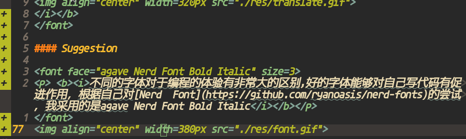

